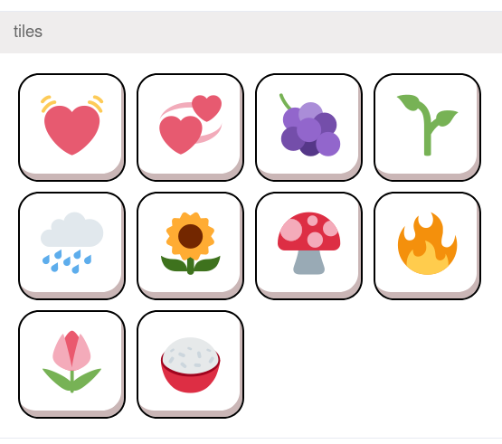
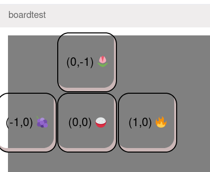

## 2019/01/14

Grid is laying out correctly :)

It seems important going forward to have good naming conventions for grid sizes vs pixels sizes etc in the code.

We'll need 'fake' tiles along the edges of the board that will show up on hover, to show where a new tile will be placed.

- inject tiles with [:fake true] or somesuch into the main grid ds before passing to the board?
- use a second loop to show the outside edges? (seems better)

Either way, we need a way of generating the grid locations of all the edges. This will be needed for validating moves as well.

**Is it worth writing this code in a functional way when the corresponding EVM code will be written in loops?**

Before the code gets too silly we need to establish some consistent names for things like grid positions.

## 2019/01/12

Still haven't woken up properly, might just read some things and try and get a handle on peer-to-peer comms in the browser.

https://developer.mozilla.org/en-US/docs/Web/API/RTCDataChannel

https://github.com/jiangts/webrtcljs/blob/master/src/cljs/rtc/data/handlers.cljs#L149

https://webrtchacks.com/datachannel-multiplayer-game/

WebRTC Tutorial - How does WebRTC work? (https://www.youtube.com/watch?v=2Z2PDsqgJP8)

https://www.html5rocks.com/en/tutorials/webrtc/basics/

https://www.html5rocks.com/en/tutorials/webrtc/infrastructure/

I think I'll leave the WebRTC stuff for later when I want to begin testing the game with multiple clients.

How shall a write the EVM code alongside the client code?
- solidity + cljs
- LLL + cljs
- somekind of EVM code compiled to cljs
- edn compiled to EVM and cljs

Trying to hold too many things in my head.. I think I need a functioning game in cljs first, using simple data and functions, then work on the EVM + WebRTC parts afterwards. I could make some demos with naughts and crosses or something but it would be a lot less fun!

Not too shabby! Don't want to fiddle with them for too long.

The board data structure is going to be important for the future EVM code that verifies moves. That said, the game is simple enough that perhaps having a separate codebase (with testing) for EVM and cljs code could be fine? I'd love to have them share code somehow through.. For now I'll just use whatever maps, vectors, sets etc. make the UI code easiest to code quickly. Who knows how the rules will change once testing starts?

Started laying things out with relative divs.

## 2019/01/11

Started a work log. It occured to me last night that sitting down to work on my own projects has begun to feel more and more difficult. I work on code related things irregularly and have started a lot of different threads. It seems like it would be easier to pick up where I left off if I have a single place to look and see what I was last doing.

Work Goals:
 - Further develop an (ethical) client base for remote coding work
 - Complete a FOSS game using Clojurescript & Ethereum
 - Complete a FOSS tool for teaching/learning
 - Participate in the Clojurescript community
 - Participate in the Ethereum community

What are my priorities? I'd like to be able to shift away from relief teaching and towards remote coding as my key income source. The ideal scenario would be making an income from a FOSS project, perhaps via Ethereum development? It seems far away. In the short term I think I need to develop my portfolio with the kind of work I want in the future. Another priority is converting the planning work I've done on my various projects into useful, working code.

It feels like the best course of action from here is identifying a single high value project and working on it until it is usable and testable by others.

### Currently Active Projects:

#### ta
progress: 10%

The code is not actually that outdated, it just needs a little freshening up to fit the new re-frame fx stuff. What do I want from this project? At one point I felt that it could be of huge use to classroom teachers / resource producers, or at least myself. Talking to some other teachers about whether they would use the platform left me a little disheartened. Teachers have such different and chaotic work patterns that using such a structured system might actually be counterproductive. I'm not sure I have the time at the moment to work on this.

#### tzolkin
progress: 50% if art left as is, 30% if art rewrite continues

Another project delayed by an attempted rewrite! I really want to finish this as it would be fun to play, even just with friends. If I do go back to this I need to do the minimum possible to the art to make it sharable and go back to firebase or something like it. Could be useful to work on but no Ethereum relevance.

#### gateworld
progress: 5%

This one's all over the place. I get stressed out just looking at all the notes and plans. Best case would be converting the Wave Function Collapse code into a simple library and releasing that.

#### glassfrog
progress: 5%

Best part of this project is that it could hypothetically be worked on alongside another ETH-based project. OR is that how I got in this position in the first place?? Best course of action is probably build something simple using ETH&cljs first, then use that knowledge to build glassfrog, then use glassfrog to build the next project?

#### emojitiles
progress: 10%

Probably my best option. A simple game using ETH and clojurescript. Gahh it's depressing looking at these progress numbers. I'm getting tired of writing and not coding, let's go!

Possible steps to building an emojitiles mvp:
- read teachers-nightmare code as gamedev refresher
- setup repo (pull in any stuff from other repos)
- design board data structure (EVM & cljs)
- code board state transformations (board, tile, loc) -> board (EVM & cljs)
- ui for board, selecting a tile, selecting a target location
- test until game seems fun
- code move passing
- play with others until game is actually fun

take breaks in the **middle** of tasks, it's easier to go back to them?

emojitiles stuff is out of gateworld code and into new repo and started reading through district0x code
https://github.com/district0x/memefactory/blob/master/project.clj
https://github.com/district0x/district-ui-web3
https://github.com/district0x/d0xperiments

What is the emojitiles game?
- 2p game
- each player brings a stack of tiles (emojis)
- both stacks are combined to form a bag
- players each take 5 tiles at random from the bag to form their hand
- players take it in turns playing as many tiles as they wish from their hand to the board then refilling their hand to 5
- tiles are always placed adjacent to an existing tile
- some tiles have requirements about where they can be placed
- some tiles remove themselves or other tiles from the board
- some tiles are worth points
- once a player has reached 10 points they win

What makes the game unique?
 - each week a new tile is added to the game and the rules for that tile are chosen by the winner of that weeks public tournament (!)
 - playable with real-life tiles or in the browser

What is the architecture of the emojitiles network?

Ideally, no servers would be required, players either send moves to each other or the ETH network via their clients. Is a server required for some kind of peer discovery? Could running such a server be compensated via ETH from the game's contracts?

Brushing up on state channels with:
https://medium.com/blockchannel/state-channel-for-dummies-part-2-2ffef52220eb
