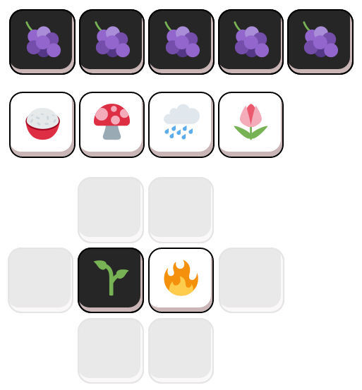
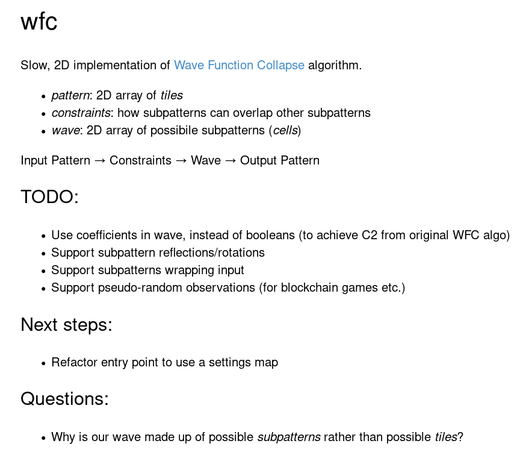
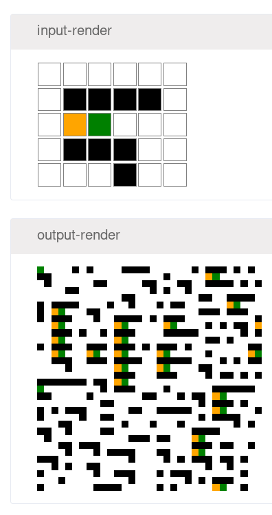
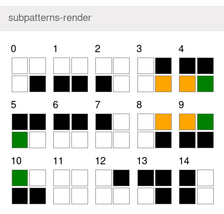
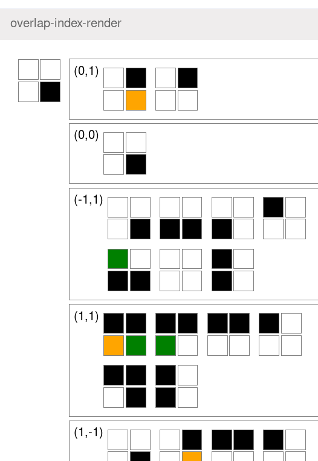
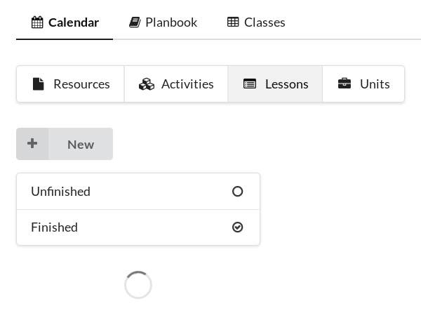

## March 27th

Fiddled with [emojinos](https://github.com/tomisme/emojinoss). Started adding a second player.

## March 19th

Struggling to find time/energy to work on side-projects at the moment. Spreading myself too thin etc. Need to find some inspiration. I opened up [gateworld](https://github.com/tomisme/gateworld) and was drawn to my unfinished [Wave Function Collapse](https://github.com/mxgmn/WaveFunctionCollapse) stuff.

I've just spent some time fiddling with my WFC code and it was fun! A little low pressure refactoring and exploring. I've started writing a little glossary/explanation at the top of my devcards as I explore my old code:

Lots still to do but it already generates some fun stuff.

Trying to visualise as many intermediate steps as possible.

## March 9th

STEPS project goals:
 - build database of free, high-quality learning materials
 - auto-convert materials -> lesson -> in-class presentation
 - monetize creating/mixing learning materials

Next step, lets get [ta](https://github.com/tomisme/ta) running again. `lein figwheel` gives us:

Success! Tries to connect to an old firebase and fails.

Fun fact, ta (teacher's assistant) was one of my first clojurescript projects, about 4 years ago now. I started on it while I was still teaching. It was using [devcards](https://github.com/bhauman/devcards) in the project that really made me fall in love with clojure.

Opening `localhost:3449/cards.html` gives us `TypeError: ReactDOM is undefined` in the console. Why does `localhost:3449/index.html` even work at all when I'm running the devcards build?

## March 2nd

Too busy with the move and client work in February but now it's March!

What's next? Still keep plugging away at emojinos?
 - With the big trip coming up, my main side-project will need to be future source of income.
 - Could switch to the new, more easily (?) monetizable, STEPS project.
 - Could also stick with emojinos and sell tickets, passes etc. to fund development

 Despite [saying in January](2019-1.md#20190111) that I'd need to focus on a single project to get it done, I think I can work on emojinos and STEPS at the same time. Onward!

 STEPS is a working title for a new project. The goal is to be a useful tool for learning things and for teaching things to others for money. It's a mobile and web application where you can put together a series of steps for learning to do something. Those steps can contain individual activities. Both steps and activities can be forked/copied. The history of those forks is viewable as a big tree. People can send donations to any activity or step and the money is split between the teachers who made that step/activity.
